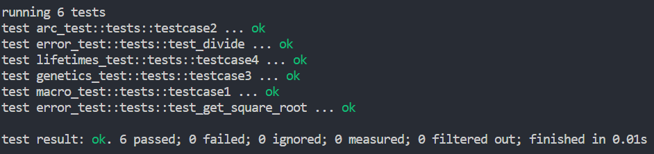
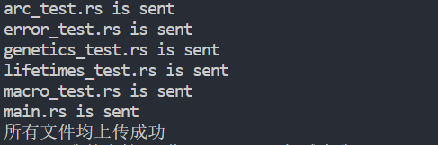

# 做题

考核全程禁止联网，禁止使用浏览器搜索，禁止使用AI辅助工具，禁止使用聊天软件等交流讨论，禁止参考本地已有的其他代码，保证独立完成。

根据注释提示来补充代码，使代码没有报错，并能通过测试。

请只修改注释提示的可以修改的函数、宏、结构体部分，禁止修改 `mod tests`中的内容，考核结束会对提交的代码进行人工审查，不符合要求者成绩作废！

# 测试

在当前目录执行 `cargo test`即可本地测试，注意只有所有文件都编译通过后才可以运行测试，当输出类似下面内容（6 passed）表示本地测试全部通过：

# 提交

连接到提供的局域网，运行 `transport_tool.py`，当输出如下内容表示成功上传：

再次上传会覆盖上次上传内容。

！！！上传文件会留档，作为成绩评定的最终版本，请谨慎提交！！！

如在考核过程中遇到任何问题，举手示意。
